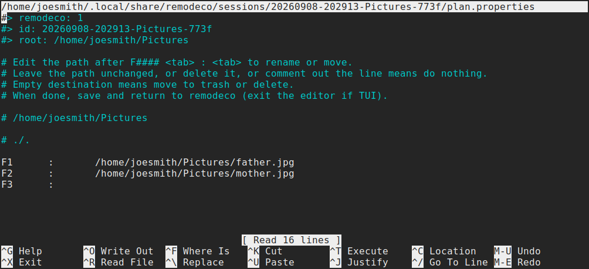
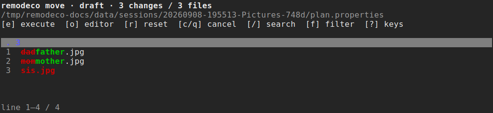

# remodeco

**RE**move  
**MO**dify  
**DE**lete  
**CO**py  

Here's how it works:

1️⃣ Run `remodeco ~/Pictures`

2️⃣ A markdown file like this opens in your editor:

```markdown
- `{01}`	/home/joesmith/Pictures/mom.jpg
- `{02}`	/home/joesmith/Pictures/dad.jpg
- `{03}`	/home/joesmith/Pictures/sis.jpg
``` 

3️⃣ Edit the file



4️⃣ Save and exit (if editor is TUI), or tab switch back into remodeco (if editor is GUI).

5️⃣ Review the changeses



6️⃣ Press `e` to execute, `o` to re-open the editor, `r` to reset the plan, or `c`/`q` to cancel.

If you accept the changes, your files will be renamed, copied, or moved to trash.

### Plan file format

Headings are labels only. Each file is represented by one strict, tab-separated
line:

```markdown
- `{01}`	/absolute/path/to/file.txt
```

| Edit | Effect                          |
| --- |---------------------------------|
| Leave the path unchanged | no operation                    |
| Change the full destination path | rename/move (or copy)           |
| Leave the destination empty after the tab | move to desktop trash or delete |
| Delete the line or comment it with `Ctrl+/` | skip                            |

### Configuration

- Per-directory configuration: `{dir}/.remodeco.json`
- User configuration: `config.json` in the platform configuration directory

### Useful commands

```sh
remodeco . --dry-run
remodeco --list-sessions
remodeco --session SESSION_ID
remodeco undo SESSION_ID
```

Run `remodeco --help` for scanning, editor, copy, and session options.

### License

MIT. Ivan Pantic.
